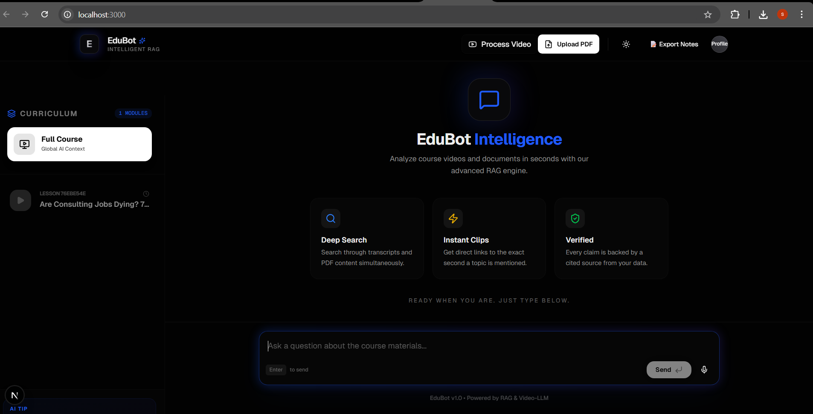
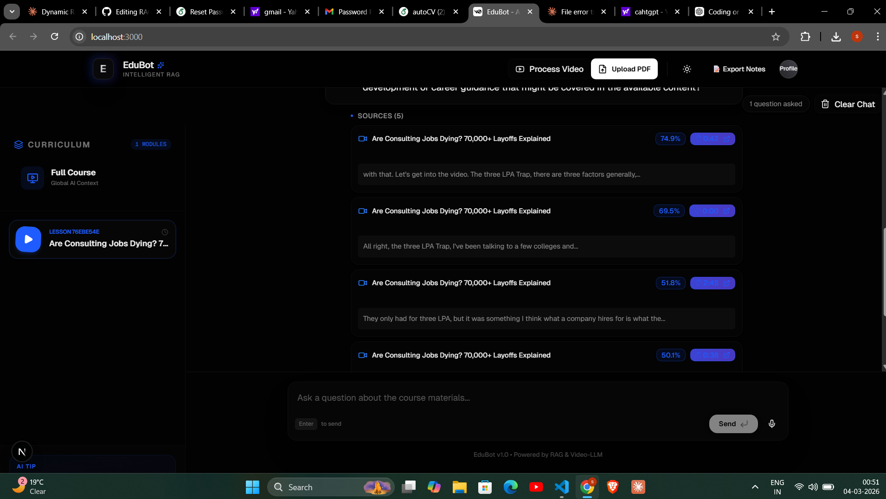
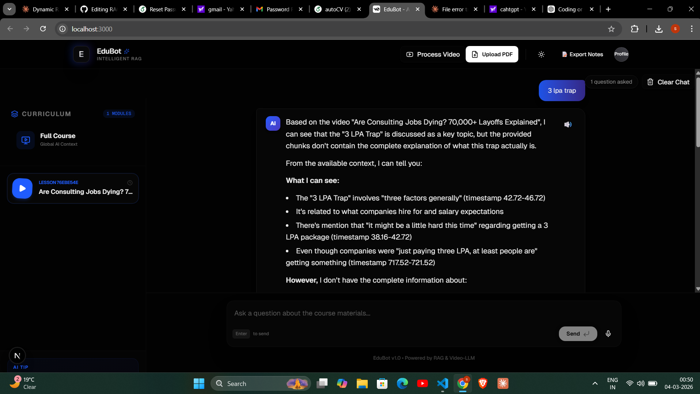

<div align="center">
# 🎓 EduBot — AI Teaching Assistant









### *Chat with your course videos and documents using RAG*

[](https://anthropic.com)
[](https://fastapi.tiangolo.com)
[](https://nextjs.org)
[](https://python.org)
[](LICENSE)

**EduBot** is a full-stack AI-powered teaching assistant that lets you ask questions directly from YouTube videos and PDF documents — with cited sources, clickable timestamps, and voice interaction.

[Features](#features) • [Tech Stack](#tech-stack) • [How It Works](#how-it-works) • [Setup](#setup) • [API Reference](#api-endpoints)

</div>

---

## ✨ Features

| Feature | Description |
|--------|-------------|
| 🎥 **YouTube Video Processing** | Paste any YouTube URL — audio is downloaded, transcribed, and indexed automatically |
| 📄 **PDF Upload & Search** | Upload PDF documents and ask questions from their content |
| 🤖 **RAG-based Q&A** | Answers grounded in your actual content using Claude Sonnet 4 — no hallucinations |
| 🔗 **Clickable Timestamps** | Every source shows the exact video timestamp where the answer comes from |
| 💬 **Conversation Memory** | Remembers previous questions within a session for natural multi-turn dialogue |
| 🎙️ **Voice I/O** | Ask questions with your voice and hear answers spoken back |
| 💡 **Suggested Questions** | Auto-generates relevant follow-up questions after every answer |
| ⚡ **Real-time Progress** | WebSocket-based live progress updates during video processing |
| 📥 **Export Chat as PDF** | Download your full Q&A session as a formatted PDF |

---

## 🛠 Tech Stack

| Layer | Technology |
|-------|-----------|
| **Frontend** | Next.js, TypeScript, Tailwind CSS, shadcn/ui |
| **Backend** | FastAPI, Python 3.11+ |
| **AI Model** | Claude Sonnet 4 (Anthropic) |
| **Embeddings** | sentence-transformers (all-MiniLM-L6-v2) |
| **Transcription** | OpenAI Whisper (CPU) |
| **Audio Download** | yt-dlp |
| **Conversation Memory** | LangGraph InMemorySaver |
| **Vector Search** | scikit-learn cosine similarity |
| **Vector Storage** | QuartzDB |

---

## 🧠 How It Works

```
YouTube URL ──► yt-dlp ──► Whisper (transcription) ──► JSON chunks ──►┐
                                                                        │
PDF Upload ──► Text extraction ──► JSON chunks ──────────────────────►│
                                                                        ▼
                                                              Embedding Generation
                                                           (all-MiniLM-L6-v2)
                                                                        │
                                                                        ▼
                                                             QuartzDB Vector Store
                                                                        │
User Question ──► Embed Query ──► Cosine Similarity ──► Top-5 Chunks ──►│
                                                                        ▼
                                                             Claude Sonnet 4
                                                                        │
                                                                        ▼
                                              Answer + Sources + Timestamps + Suggestions
```

---

## 📁 Project Structure

```
EduBot/
├── api.py                  # FastAPI backend & all endpoints
├── create_chunks.py        # YouTube/audio transcription pipeline
├── preprocess_json.py      # Embedding generation
├── process_youtube.py      # YouTube processor (used by API)
├── process_pdf.py          # PDF processor
├── jsons/                  # Transcript JSON files
├── audios/                 # Temporary audio files
├── frontend/               # Next.js app
│   ├── app/
│   ├── components/
│   └── ...
└── .env                    # API keys
```

---

## 🚀 Setup

### Prerequisites
- Python 3.11+
- Node.js 18+
- ffmpeg installed on your system
- Anthropic API key

### 1. Clone the repo
```bash
git clone https://github.com/SunnyRajput9198/RAG-Based-Ai-Assistant.git
cd RAG-Based-Ai-Assistant
```

### 2. Backend Setup
```bash
python -m venv venv
source venv/Scripts/activate  # Windows
# source venv/bin/activate    # Mac/Linux
pip install -r requirements.txt
```

Create a `.env` file in the root:
```env
ANTHROPIC_API_KEY=your_api_key_here
```

### 3. Start Backend
```bash
uvicorn api:app --reload
# Runs on http://localhost:8000
```

### 4. Start Frontend
```bash
cd frontend
npm install
npx next dev
# Runs on http://localhost:3000
```

---

## 📡 API Endpoints

| Method | Endpoint | Description |
|--------|----------|-------------|
| `POST` | `/chat` | Ask a question |
| `GET` | `/videos` | List all indexed videos |
| `GET` | `/documents` | List all uploaded PDFs |
| `POST` | `/process` | Add a YouTube video |
| `POST` | `/upload-pdf` | Upload a PDF document |
| `WS` | `/ws/process-video` | Real-time video processing progress |
| `POST` | `/clear-history` | Clear chat session history |

---

## 📸 Screenshots

> **Home Screen** — Clean dark UI with Deep Search, Instant Clips, and Verified answers

> **Source Panel** — Retrieves top-5 semantically relevant chunks with similarity scores and clickable timestamps

---

## 📄 License

MIT — feel free to use, modify, and build on this project.

---

<div align="center">

Built with ❤️ by [Sunny Raj](https://github.com/SunnyRajput9198)

*Powered by RAG & Video-LLM*

</div>